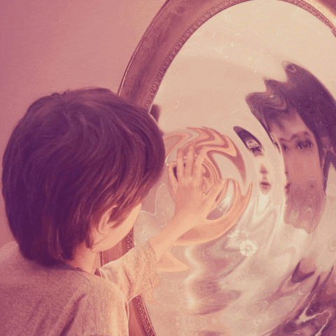

# mirror-mirror-WOW 🪞🪞🪞

</div></p>

## Table of Contents 📖

- [Description](#description)
- [User Story](#user-story)
- [Usage](#usage)
- [Credits](#credits)
- [Live Site](#live-site🪞)
- [WireFrame](#wireframe)
- [Demo Walk-through Video](#demo-walk-through-video)
- [Mirror-Mirror Engineers](#mirror-mirror-engineers)
- [Screenshots](#screenshots)
- [Technology-Used](#technology-used)

# Description:

🪞**Mirror, Mirror**🪞 is a CRUD (Create, Read, Update, Delete), user friendly application that is geared towards mental health and overall-wellness.

The goal of 🪞**Mirror, Mirror**🪞 is to allow the user that they are not alone and to empower the user to seek the help they need as well as provide resources on a local and national level. The app includes the **ACE Quiz** which is a quiz to see how childhood trauma impacts ones lives as well as the predisposed disposition towards incarceration.

The categories covered in 🪞**Mirror, Mirror** 🪞: Mental Health, Justice Impacted Information, Local and National Resources, Over-All Wellness, Physical Health, as well as the ability to allow the user to leave a comment and leave a review of not only the website but also the resources too.

# User Story

</div></p>
As a person navigating life and the stressors in which each of us faces, but handle very differently. I want to be able to access local and national resources to assist in being proactive in my own mental health wellness and self care.

# Usage

To use 🪞**Mirror-Mirror** 🪞

## _Clone the repository from Github_

Clone the repository from Github into a directory.

```bash
  git clone <repository> <path>
```

---

### _Setting up the Virtual Environment_

Now create a new virtual environment.

Run the following command:

```bash
  python -m venv venv  # you may have to use python3 instead of python
```

Activate the virtual environment.

Run one of the following commands depending on the type of operating system you are using:

> MacOS, Linux, ChromeOS:  
> `source venv/bin/activate`  
> Windows:  
> `venv\Scripts\activate.bat`

---

### _Install Project Dependencies_

Install the project dependencies.

Navigate to the project root directory.

Run the following commands:

```bash
  pip install django
```

```bash
  pip freeze install
```

```bash
  pip freeze > requirements.txt
```

---

### _Running the Application_

Navigate to the `mirror-mirror` directory.

Run the following command:

```bash
  python manage.py runserver
  # you may have to replace python with python3
```

Point your browser to use the app:
[http://localhost:8000](http://localhost:8000)

---

### _Stopping the Application_

Shut down the server.

Run the following command in the terminal:

```bash
  Ctrl+C
```

---

### _Exiting the Virtual Environment_

Run the following command:

```bash
  deactivate
```

## Technology used

- Bootstrap
- Javascript
- HTML
- CSS
- VS Code
- GitHub
- Miro

**Additionally:**

- [Python](https://docs.python.org/3/tutorial/datastructures.html) data structures such as Lists, Dictionaries and their associated methods
- [Python Classes and Inheritance](https://docs.python.org/3/tutorial/classes.html)
- [Django URLs](https://docs.djangoproject.com/en/3.2/topics/http/urls/) to understand how to capture parameters in views
- [Django Templates](https://docs.djangoproject.com/en/3.2/ref/templates/language/)
- [Django Migrations](https://docs.djangoproject.com/en/4.0/topics/migrations/)
- [Django Models](https://docs.djangoproject.com/en/4.0/topics/db/models/)
- [Django Shell](https://docs.djangoproject.com/en/4.0/ref/django-admin/)
- [Django Post Create Content](https://docs.djangoproject.com/en/4.0/ref/request-response/)
- [Django Static CSS](https://learndjango.com/tutorials/django-static-files)
- [Django HTML](https://docs.djangoproject.com/en/4.0/topics/templates/)

---
## Mirror-Mirror Engineers👑
- [Asha Maurya](https://github.com/jtc21am)👑
- [Mianta McKnight](https://github.com/RogueStorm7)👑
- [Sierra Nash](https://github.com/sasianan19)👑

## Screenshots
</div></p>
</div></p>
</div></p>
</div></p>
</div></p>
</div></p>

<!-- ## Demo Walk-through Video
[Walk-through]() -->
## Live Site🪞
[Mirror-Mirror](http://127.0.0.1:5500/wowproject/mirrormirror/templates/home.html)

## WireFrame
[WireFrame](https://drive.google.com/file/d/1CTd8dfdTaxkyccGtvsQz1C4dCvKLoq5F/preview)

### Credits
Images used for **Mirror-Mirror** obtained through [Unsplash](https://unsplash.com) and [Pexels](https://www.pexels.com/)

**ACE Quiz** stats and resources obtained through [Kaiser Permanente](https://thrive.kaiserpermanente.org/care-near-you/northern-california/napasolano/health-resources/adverse-childhood-experiences-aces/)

**NOTE:** We are taking no additional collaborations at this time.

© 2022 Asha Maurya 👩🏿‍💻, Mianta McKnight 👩🏿‍💻, and Sierra Nash 👩🏿‍💻 🔥 Queens of Code V2 🔥 | All rights reserved |